# Áp dụng thuật toán tìm kiếm vào bài toán 8-Puzzle

## 1. Mục tiêu
Thuật toán tìm kiếm là một trong những thuật toán nền tảng và cốt lõi trong lĩnh vực trí tuệ nhân tạo.
Để củng cố và vận dụng linh hoạt những kiến thức đã học. Với yêu cầu, xây dụng một chương trình giải bài toán 8-Puzzle.

**Các mục tiêu đề ra:**
- Xây dựng một chương trình có giao diện dễ sử dụng
- Áp dụng đầy đủ các thuật toán tìm kiếm
- Hỗ trợ ghi kết qua ra file.

## 2. Nội dung
### 2.1. Các thuật toán tìm kiếm không có thông tin
**Những thành phần chính.**
- Không gian trạng thái: Vị trí các ô số trong bảng 3*3
- Các hành động: di chuyển ô trống: lên, xuống, trái, phải
- Trạng thái xuất phát: [1,2,3,5,4,6,0,8,7]
- Trạng thái mục tiêu: [1,2,3,4,5,6,7,8,0]
- Chi phí: mỗi hành động có giá = 1
- Solution: Sử dụng cấu trúc queue, stack để lưu trữ trạng thái mở rộng. Duyệt qua từng trạng thái đến khi tìm thấy trạng thái mục tiêu.

#### - 2.1.1. BFS
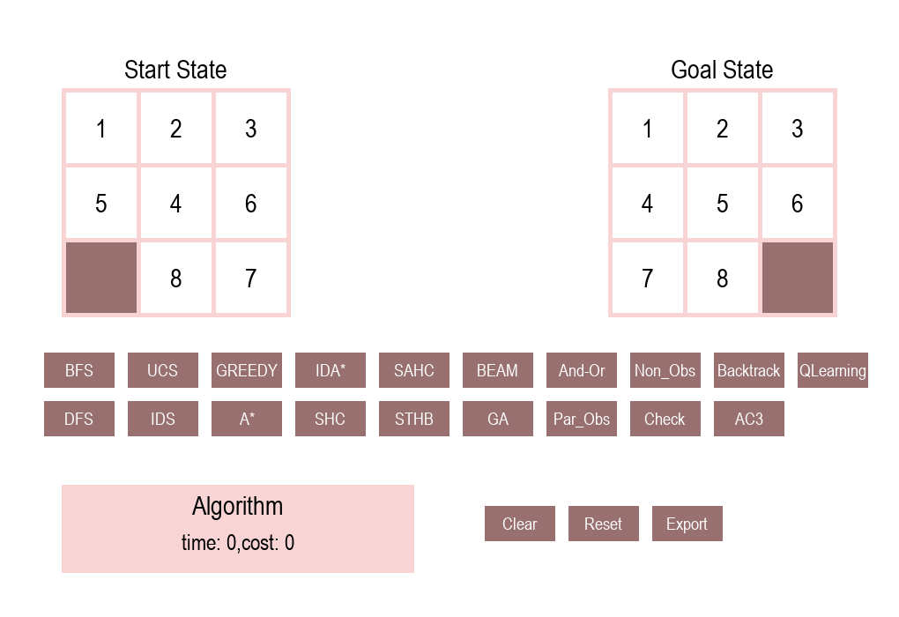
#### - 2.1.2. DFS

#### - 2.1.3. UCS

#### - 2.1.4. IDS

**So sánh hiệu suất về thời gian:**

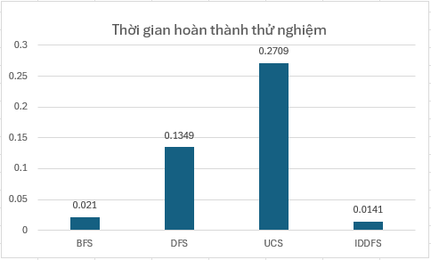

**Nhận xét:**
- BFS phù hợp với tìm kiếm không có trọng số và thường tìm lời giải tối ưu nếu độ sâu nhỏ. Hiệu quả khá cao.
- DFS nếu không gặp lời giải sớm, càng đi sâu thời gian sẽ càng lớn.
- UCS đảm bảo tìm lời giải tối ưu, nhưng trong bài toán 8 puzzle chi phí mỗi bước đi đồng đều nên thời gian tìm kiếm chậm hơn BFS.
- IDDFS là sự kết hợp ưu điểm của BFS và DFS, nên tối ưu hơn về chi phí, thời gian lẫn không gian bộ nhớ.

### 2.2. Các thuật toán tìm kiếm có thông tin
**Những thành phần chính.**
- Không gian trạng thái: Vị trí các ô số trong bảng 3*3
- Các hành động: di chuyển ô trống: lên, xuống, trái, phải
- Trạng thái xuất phát: [1,2,3,5,4,6,0,8,7]
- Trạng thái mục tiêu: [1,2,3,4,5,6,7,8,0]
- Chi phí: mỗi hành động có giá = 1
- Solution: Xây dựng hàm heuristic để dự đoán chi phí (h(n)). 
Chi phí đi được tính trạng thái ban đầu đến trạng thái hiện tại (g(n)).
Tổng chi phí f(n) = h(n) + g(n).
Ưu tiên đường đi có chi phí thấp nhất.
#### - 2.2.1. Greedy

#### - 2.2.2. A*

#### - 2.2.3. IDA*

**So sánh hiệu suất về thời gian:**

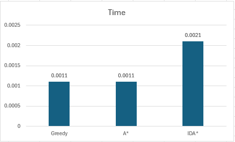

**Nhận xét:**
- Greedy và A* đều rất nhanh, nhưng A* ưu việt hơn vì đảm bảo lời giải tốt.
- IDA* là phiên bản cải tiến về bộ nhớ của A*, IDA* chậm hơn do việc lặp lại, phù hợp khi bộ nhớ bị giới hạn.

### 2.3. Các thuật toán tìm kiếm cục bộ
**Những thành phần chính.**
- Không gian trạng thái: Vị trí các ô số trong bảng 3*3
- Các hành động: di chuyển ô trống: lên, xuống, trái, phải
- Trạng thái xuất phát: TH1: [1,2,3,5,4,6,0,8,7], TH2: [1,8,2,0,4,3,7,6,5]
- Trạng thái mục tiêu: [1,2,3,4,5,6,7,8,0]
- Chi phí: mỗi hành động có giá = 1
- Solution: Lựa chọn trạng thái sau luôn tốt hơn trạng thái trước dựa trên chi phí dự đoán h(n). 
Beam: lưu tập giới hạn các trạng thái tốt nhất ở mỗi cấp, giúp tránh điểm local maximum.
#### - 2.3.1. Simple hill climbing
- TH1: [1,2,3,5,4,6,0,8,7] : Không tìm được đường đi
- TH2: [1,8,2,0,4,3,7,6,5]
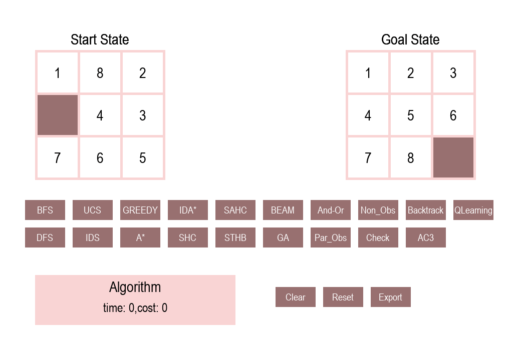
#### - 2.3.2. Stochastic hill climbing
- TH1: [1,2,3,5,4,6,0,8,7] : Không tìm được đường đi
- TH2: [1,8,2,0,4,3,7,6,5]

#### - 2.3.3. Steepest Ascent hill climbing
- TH1: [1,2,3,5,4,6,0,8,7] : Không tìm được đường đi
- TH2: [1,8,2,0,4,3,7,6,5]

#### - 2.3.4. Beam Search
- TH1: [1,2,3,5,4,6,0,8,7]

- TH2: [1,8,2,0,4,3,7,6,5]

#### - 2.3.5. Generate Seach
- TH1: [1,2,3,5,4,6,0,8,7]

- TH2: [1,8,2,0,4,3,7,6,5]

**So sánh hiệu suất về thời gian:**

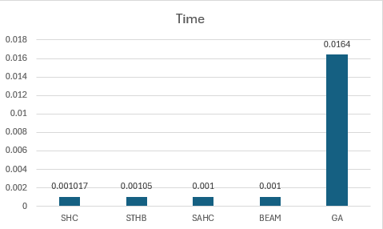

**Nhận xét:**
- SHB,STHB,SAHC có ưu điểm tìm kiếm rất nhanh. Nhược điểm, nhiều trường hợp không tìm được lời giải do tìm kiếm trên 1 vùng cục bộ, dễ bị kẹt ở điểm local maximum.
- Beam dùng để giải quyết nhược điểm trên bằng cách chọn 1 tập giới hạn trạng thái tối ưu. 
- GA là thuật toán tiến hóa mô phỏng tự nhiên, đòi hỏi nhiều vòng lặp (generation), nhiều phép lai ghép và đột biến.
### 2.4. Các thuật toán tìm kiếm trong môi trường phức tạp
**Những thành phần chính.**
- Không gian trạng thái: Vị trí các ô số trong bảng 3*3
- Các hành động: di chuyển ô trống: lên, xuống, trái, phải
- Trạng thái xuất phát: tập trạng thái niềm tin (ramdom 1000 trạng thái khác nhau)
- Trạng thái mục tiêu: [1,2,3,4,5,6,7,8,0]
- Chi phí: mỗi hành động có giá = 1
- Solution: partial_observe, sử dụng 1 phần quan sát được để loại bỏ những trạng thái không phù hợp, giúp giảm không gian trạng thái cần duyệt.
#### - 2.4.1. Non-Observe
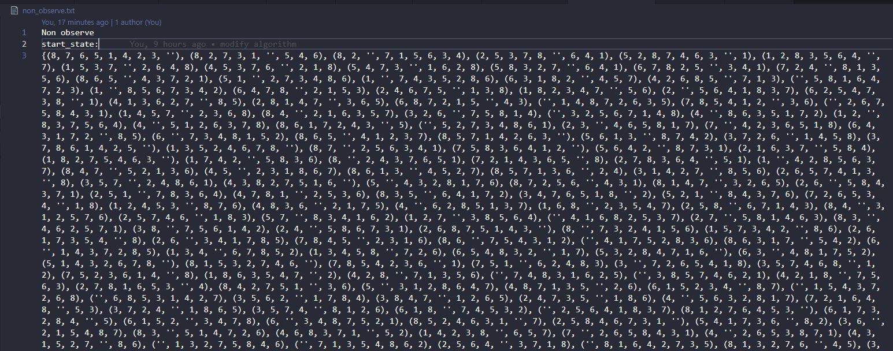
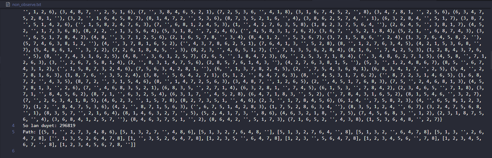
#### - 2.4.2. Partial-Observe
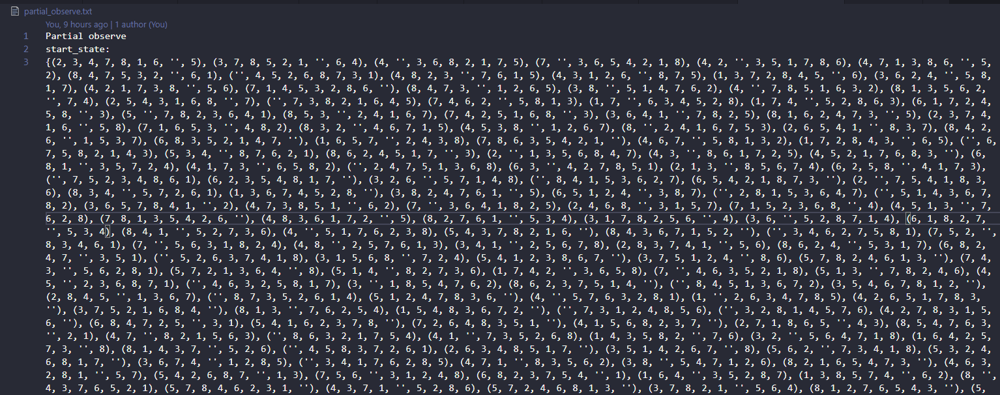
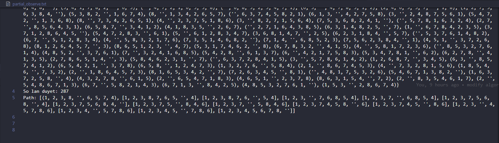
#### - 2.4.3. AndOr
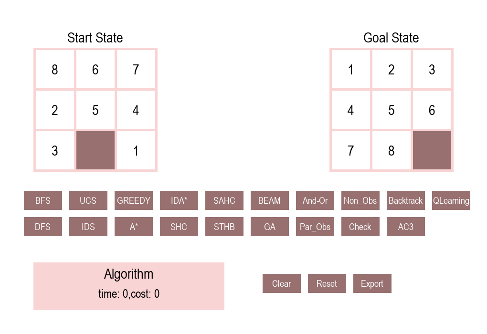

**Nhận xét:** Không giống như các thuật toán ở trên, tìm kiếm trong môi trường phức tạp không có chính xác trạng thái ban đầu, trạng thái đích mà dựa vào tập trạng thái niềm tin, vì thế không gian trạng thái vô cùng lớn.

### 2.5. Các thuật toán tìm kiếm trong môi trường ràng buộc
- Không gian trạng thái: Vị trí các ô số trong bảng 3*3
- Các hành động: di chuyển ô trống: lên, xuống, trái, phải
- Trạng thái xuất phát: []
- Trạng thái mục tiêu: [1,2,3,4,5,6,7,8,0]
- Chi phí: mỗi hành động có giá = 1
- Solution: Dựa vào điều kiện ràng buộc để gán giá trị cho từng biến, đến khi tất cả biến thỏa điều kiện. 
#### - 2.5.1. Checked

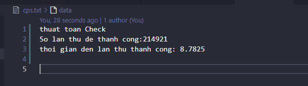
#### - 2.5.2. BackTracking

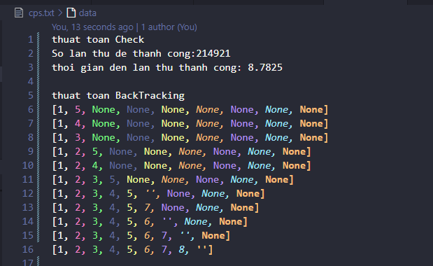
#### - 2.5.3. AC-3

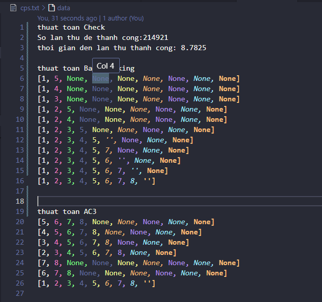

**Nhận xét:**
- Trong nhóm thuật toán này, ta dựa vào tập ràng buộc để chọn gán giá trị cho tập biến sao cho tất cả các ràng buộc được thỏa mãn.
- Check: Là cách đơn giản nhất, sinh ra 1 trạng thái rồi kiểm tra có đúng tập ràng buộc. Nếu không thỏa thì loại bỏ, tiếp tục thử trạng thái mới.
- Backtracking: gán giá trị cho từng biến rồi kiểm tra ràng buộc. Nếu không hợp lệ thì quay lui để thử giá trị khác.
- AC3: Duyệt tất cả các cặp biến liên kết, Nếu giá trị không còn hợp lệ thì xóa khỏi miền. Nếu một miền bị rỗng => không có lời giải tại trạng thái này.
### 2.6. Q-Learning
- Không gian trạng thái: Vị trí các ô số trong bảng 3*3
- Các hành động: di chuyển ô trống: lên, xuống, trái, phải
- Trạng thái xuất phát: [1,8,2,0,4,3,7,6,5]
- Trạng thái mục tiêu: [1,2,3,4,5,6,7,8,0]
- Chi phí: mỗi hành động có giá = -1, khi đến vị trí đích điểm thưởng là 100
- Solution: Đánh giá mỗi bước đi qua giá trị Q_value, chọn bước đi với điểm thưởng tốt nhất

**công thức áp dụng**

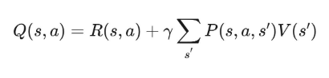

**Nhận xét:**
Q-learning là một thuật toán học tăng cường, thuộc nhóm học không giám sát, dùng để giúp một tác nhân  học cách hành động tối ưu trong một môi trường nhằm tối đa hóa phần thưởng tổng cộng.
- Agent: Tác nhân, người học.
- Environment: Môi trường mà tác nhân tương tác.
- State (s): Trạng thái hiện tại của môi trường.
- Action (a): Hành động mà tác nhân có thể thực hiện tại trạng thái hiện tại.
- Reward (r): Phần thưởng nhận được sau khi thực hiện hành động.
- Q-value Q(s, a): Giá trị kỳ vọng của phần thưởng khi thực hiện hành động a tại trạng thái s.

## 3. Kết luận
Việc áp dụng các thuật toán tìm kiếm vào bài toán 8 puzzle giúp so sánh hiệu quả giữa các phương pháp. Nắm được ưu, nhược điểm của từng thuật toán, chúng ta có thể vận dụng linh hoạt hơn vào nhiều trường hợp với yêu cầu khác nhau như tối ưu thời gian, bộ nhớ hay tốc độ xử lý.

**Kết quả đạt được:**
- Áp dụng thành công các nhóm thuật toán vào bài toán 8 puzzle.
- So sánh hiệu suất của các thuật toán khác nhau. Từ đó nắm rõ được ưu, nhược điểm của từng thuật toán.
- Học cách tìm hiểu, giải quyết vấn đề 1 cách linh hoạt.
- Áp dụng các kiến thức khác như pygame, để xây dựng chương trình giao diện hoàn chỉnh.

## 4. Tài liệu tham khảo
- Russell, S., & Norvig, P. (2016). Artificial Intelligence: A Modern Approach (3rd ed.). Pearson.

## 5. Tác giả
**Ngô Huy Hoàng**
- MSSV: 23110220
- Môn: Trí tuệ nhân tạo
- GVHD: Phan Thị Huyền Trang 
